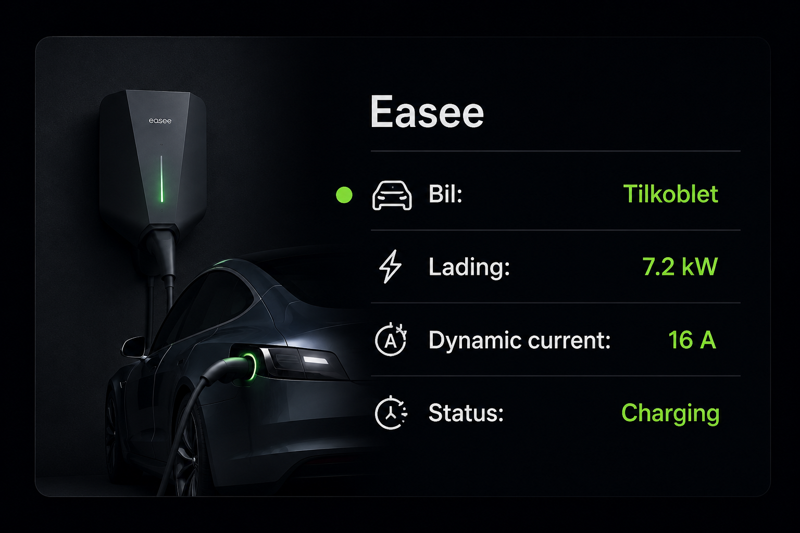

# MMM-Easee-Status

A clean, dark and premium MagicMirror² module for showing live status from an Easee EV charger.

It shows exactly the essentials:

- Car connected / disconnected
- Charging power in kW
- Dynamic current in A
- Charger status



## Screenshot style

The module is built with a dark AMOLED-friendly card, charger/car illustration, green charging accents and large readable values.

## Installation

Go to your MagicMirror `modules` folder:

```bash
cd ~/MagicMirror/modules
```

Or, for many Proxmox/helper-script installs:

```bash
cd /opt/magicmirror/modules
```

Clone the repository:

```bash
git clone https://github.com/YOUR_USERNAME/MMM-Easee-Status.git
cd MMM-Easee-Status
npm install
```

Restart MagicMirror after adding the config.

## Configuration

Add this to `config/config.js`:

```js
{
  module: "MMM-Easee-Status",
  position: "top_right",
  config: {
    title: "Easee",
    username: "DIN_EASEE_EPOST",
    password: "DITT_EASEE_PASSORD",
    chargerId: "EHXXXXXX",
    updateInterval: 60 * 1000,
    showChargerImage: true,
    showCarImage: true,
    showIcons: true,
    debug: false
  }
}
```

## Options

| Option | Type | Default | Description |
|---|---:|---:|---|
| `title` | string | `Easee` | Module title. |
| `username` | string | empty | Easee account username/email. |
| `password` | string | empty | Easee account password. |
| `chargerId` | string | empty | Easee charger ID, for example `EH123456`. |
| `updateInterval` | number | `60000` | Refresh interval in milliseconds. |
| `showChargerImage` | boolean | `true` | Shows the charger illustration. |
| `showCarImage` | boolean | `true` | Shows the EV illustration. |
| `showIcons` | boolean | `true` | Shows row icons. |
| `useMetricLocale` | boolean | `true` | Uses Norwegian number formatting. |
| `debug` | boolean | `false` | Logs normalized data to the MagicMirror console. |

## Finding your charger ID

The charger ID is usually visible in the Easee app or installer/admin pages. It often looks like `EH123456`.

## What it displays

Example while charging:

```text
Easee
Bil: Tilkoblet
Lading: 7.2 kW
Dynamic current: 16 A
Status: Charging
```

Example when disconnected:

```text
Easee
Bil: Ikke tilkoblet
Lading: 0.0 kW
Dynamic current: 16 A
Status: Disconnected
```

## Notes

This module reads charger data from the Easee cloud API. It does not start, stop or change charging. It is display-only.

The module tries multiple known field names from Easee state/observation responses because Easee integrations and endpoints may expose slightly different keys.

## Troubleshooting

### Shows `Mangler username, password eller chargerId`

Your config is missing one of the required values.

### Shows `Easee API-feil 401`

Your username/password is wrong, the account requires another login method, or Easee rejected the token.

### Shows `0.0 kW` while charging

Set `debug: true`, restart MagicMirror and inspect the logs:

```bash
pm2 logs MagicMirror
```

or:

```bash
journalctl -u magicmirror -f
```

Depending on your installation.

## Security note

Your Easee username and password are stored in `config.js`. Keep your MagicMirror server private and do not publish your real config to GitHub.

Use `config/config.js.sample` for public examples instead.

## License

MIT
